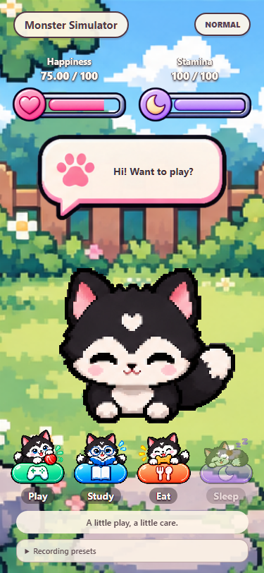

# Monster Simulator

An offline JavaScript virtual pet assignment. Open `index.html` in Chrome, Edge or Safari. No installation or internet is required after downloading the project.

Happiness is capped at 100 and decreases by exactly 0.01 once per second. Play adds 0.5 and Study subtracts 0.5. Both spend 10 stamina. Eat adds 20 stamina and 5 happiness; Sleep restores stamina to 100. The assignment did not specify food amounts or stamina costs, so those values are explicit choices.

Play and Study work at stamina 20 but lock below 20. Sleep works only below 20. Happiness exactly 100 shows the happy animation; 50 or below shows sad. The next passive tick takes 100 to 99.99, so the happy state correctly ends then. Mood animations take priority over action animations.

The model stores integer hundredths to avoid floating-point drift at the exact 100 and 50 boundaries. The layout matches PocketPet: a full-height backyard, glossy action buttons, floating speech bubble and illustrated meters. Only Happiness, Stamina and the four assignment actions remain. Per-frame body centers keep the tail from shifting the pup sideways. Browser animation frames update sprites at approximately six frames per second. Game ticks are independent of animation speed.

Run logic tests with `npm test` using Node.js. Recording presets are clearly labelled and reset the initial values only; they never change the rules or decay rate. Reload starts a new pet. There is no saved progress.

This assignment explicitly requests a program in a language of choice; it uses its own JavaScript source instead of the previous Unity assignment's fixed scripts. The previous Unity projects are untouched. Artwork is reused from the separate PocketPet-sprites repository.

## Recording

Open Recording presets during your recording. Show New pet for two seconds to prove 75.00 becomes 74.98. Choose Almost happy and immediately press Play to show 100.00 and HAPPY before the next tick. Choose A quiet mood and immediately press Study to show 50.00 and SAD. Choose Nearly tired to show Sleep locked at 20; press Study to show stamina 10, work locked and Sleep unlocked. Press Sleep to show stamina 100 and Sleep locked again. All scenarios use the normal action validation.

Record and name your video `MARTINEZ_MONSTER.mp4`.

Submission: the full source ZIP plus `MARTINEZ_MONSTER.mp4`. The video must be uploaded to Google Drive for the course; a GitHub video download is not a Drive submission.
